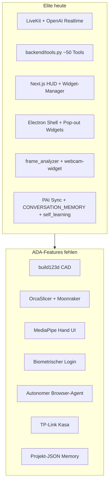
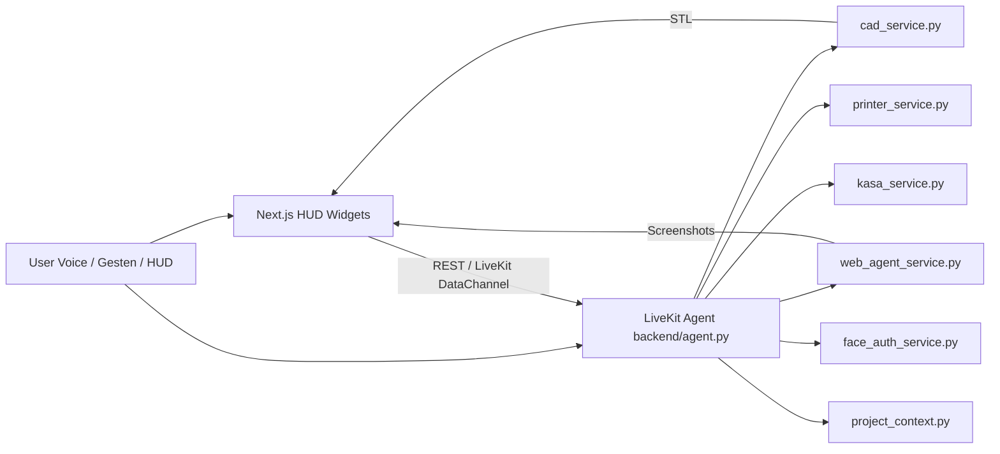

# ADA v2 → Elite Desktop Agent: Integrationsplan

## Ausgangslage

### Was [ada_v2](https://github.com/nazirlouis/ada_v2) macht

ADA ist ein **Electron + React + Python (FastAPI/Socket.IO)**-Assistent mit **Gemini Live** als Voice-Brain. Fähigkeiten sind als **spezialisierte Python-Module** + **schwebende UI-Fenster** umgesetzt:


| ADA-Modul  | Datei                        | Kernidee                                                      |
| ---------- | ---------------------------- | ------------------------------------------------------------- |
| Voice      | `backend/ada.py`             | Gemini 2.5 Native Audio                                       |
| CAD        | `backend/cad_agent.py`       | LLM schreibt `build123d`-Script → subprocess → STL            |
| 3D-Druck   | `backend/printer_agent.py`   | OrcaSlicer CLI + Moonraker/OctoPrint REST + mDNS              |
| Web-Agent  | `backend/web_agent.py`       | Playwright + **Gemini Computer Use** (Screenshot-Loop)        |
| Smart Home | `backend/kasa_agent.py`      | `python-kasa` Discovery + Steuerung                           |
| Face Auth  | `backend/authenticator.py`   | MediaPipe Face Landmarker vs. `reference.jpg`                 |
| Gesten     | `src/App.jsx`                | `@mediapipe/tasks-vision` HandLandmarker im Frontend          |
| Memory     | `backend/project_manager.py` | `projects/{name}/` mit JSONL-Chat, CAD, Browser-Artefakten    |
| UI         | `src/components/*.jsx`       | CadWindow, BrowserWindow, KasaWindow, PrinterWindow, AuthLock |


Gesten-Logik in ADA (Referenz für Elite):

```916:998:ada_v2/src/App.jsx
// Pinch: Index–Daumen < 0.05 → Klick
// Fist: alle Finger gefaltet → Fenster greifen (wrist-basiertes Drag)
// Open Palm: Fist loslassen → Fenster freigeben
```

### Was Elite bereits hat

Elite ist **architektonisch reifer**, aber in ADA-Richtungen **lückenhaft**:




**Bereits vorhanden (wiederverwenden, nicht neu bauen):**

- Voice + Tools: `[backend/agent.py](backend/agent.py)`, `[backend/tools.py](backend/tools.py)`
- Browser (einfach): `browser_automation`, `open_website`, Vision-Klick — Playwright **optional**, nicht in `[backend/requirements.txt](backend/requirements.txt)`
- Webcam/Vision: `[frontend/components/dashboard/webcam-widget.tsx](frontend/components/dashboard/webcam-widget.tsx)`, `[backend/frame_analyzer.py](backend/frame_analyzer.py)` — **Face Auth fehlt** (nur Ästhetik-Report)
- Memory (über ADA hinaus): PAI-Mirror, `[backend/self_learning.py](backend/self_learning.py)`, `[backend/sync_pai_memory.py](backend/sync_pai_memory.py)`
- Widget-System + Pop-out: `[frontend/components/dashboard/widget-manager.tsx](frontend/components/dashboard/widget-manager.tsx)`, `[frontend/app/widget/[id]/page.tsx](frontend/app/widget/[id]/page.tsx)`
- 3D-Orb (nur Visualisierung): R3F in `[frontend/app/page.tsx](frontend/app/page.tsx)` — **kein STL-Viewer**

**Deine Präferenzen für diesen Plan:**

- Hardware (Kasa/Drucker): **später** — UI + Mock/Config zuerst
- LLM: **Hybrid** — OpenAI default, Gemini optional via `.env`

---

## Zielarchitektur für Elite

ADA ersetzt Elite **nicht**. Statt Socket.IO + Gemini-Live bauen wir **Capability-Module** als Python-Services/Tools und **HUD-Widgets** auf der bestehenden Elite-Schicht:




**Kommunikationsprinzip:**

- **Agent-Tools** (LiveKit `function_tool`) rufen Python-Module auf — wie heute `browser_automation` oder `trigger_self_healing_workflow`
- **Fortschritt/Artefakte** → LiveKit DataChannel (bereits in `[log-stream-widget.tsx](frontend/components/dashboard/log-stream-widget.tsx)`) + Widget-State
- **Lange Jobs** (CAD, Web-Agent, Slice) → async mit Status-Events, nicht blockierend im Voice-Thread

---

## Phasenplan (empfohlene Reihenfolge)

### Phase 0 — Fundament (1–2 Wochen)

**Ziel:** Gemeinsame Infrastruktur für alle ADA-Module, ohne Feature-UI.

1. **Capability-Registry & Settings**
  - Neue Datei: `backend/elite_capabilities.yaml` oder Erweiterung von `[backend/elite_config.py](backend/elite_config.py)`
  - Keys analog ADA `settings.json`: `face_auth_enabled`, `tool_permissions`, `gemini_api_key` (optional), `printers[]`, `kasa_devices[]`, `cad_output_dir`
  - Persistenz: `%LOCALAPPDATA%/EliteDesktopAgent/settings.json`
2. **Tool-Permission-Gate** (ADA-Pattern)
  - Vor riskanten Tools (`generate_cad`, `run_web_agent`, `slice_and_print`, `kasa_control`) HUD-Confirm-Modal
  - Vorbild: ADA `[ConfirmationPopup.jsx](https://github.com/nazirlouis/ada_v2/blob/main/src/components/ConfirmationPopup.jsx)`
  - Elite-Anknüpfung: bestehendes Toast/Widget-Pattern + LiveKit DataChannel `tool_confirmation_request`
3. **Projekt-Kontext (ADA Project Memory → Elite)**
  - Port von ADA `[project_manager.py](https://github.com/nazirlouis/ada_v2/blob/main/backend/project_manager.py)` nach `backend/project_context.py`
  - Speicherort: `%LOCALAPPDATA%/EliteDesktopAgent/projects/{name}/` mit Unterordnern `cad/`, `browser/`, `chat_history.jsonl`
  - **Integration mit PAI:** Projekt-Switch aktualisiert `CURRENT_WORK.md`-Snippet via bestehendem `[sync_pai_memory.py](backend/sync_pai_memory.py)` — kein Ersatz für PAI, sondern **task-scoped Memory**
  - Neue Tools: `create_project`, `switch_project`, `list_projects`, `get_project_context`
4. **Dependencies dokumentieren & optional installieren**
  - Erweiterung `[backend/requirements.txt](backend/requirements.txt)`: `build123d`, `mediapipe`, `python-kasa`, `zeroconf`, `playwright` (optional group)
  - Windows-Hinweise in `[README.md](README.md)`: OrcaSlicer-Pfad, `playwright install chromium`

---

### Phase 1 — Face Authentication (2–3 Wochen)

**ADA-Referenz:** `[authenticator.py](https://github.com/nazirlouis/ada_v2/blob/main/backend/authenticator.py)` + `[AuthLock.jsx](https://github.com/nazirlouis/ada_v2/blob/main/src/components/AuthLock.jsx)`

**Elite-Umsetzung:**


| Schicht  | Aufgabe                                                                                                                                                  |
| -------- | -------------------------------------------------------------------------------------------------------------------------------------------------------- |
| Backend  | `backend/face_auth_service.py`: MediaPipe Face Landmarker, Cosine-Similarity vs. `%LOCALAPPDATA%/.../reference.jpg`, Endpoint oder LiveKit-Startup-Check |
| Frontend | Neues Widget `auth-lock-widget.tsx` oder Overlay in `[frontend/app/page.tsx](frontend/app/page.tsx)`: Kamera-Feed, Lock bis `authenticated`              |
| Agent    | In `[backend/agent.py](backend/agent.py)`: Wenn `face_auth_enabled`, blockiere Tool-Ausführung bis Auth OK (Wake-Word allein reicht nicht)               |
| Electron | Kamera-Permission in `[desktop/main.js](desktop/main.js)` — Windows Privacy Settings dokumentieren                                                       |


**Abgrenzung zu bestehendem Code:** `[face_vision.py](backend/face_vision.py)` bleibt für **Ästhetik-Reports**; Auth ist separates Modul mit Enrollment-Flow („Referenzfoto aufnehmen“).

**Sicherheit:** Nur lokal, kein Cloud-Upload; `reference.jpg` in `.gitignore`.

---

### Phase 2 — Minority Report Gesten-UI (2–3 Wochen)

**ADA-Referenz:** HandLandmarker-Loop in `[App.jsx](https://github.com/nazirlouis/ada_v2/blob/main/src/App.jsx)` (Pinch/Fist/Palm)

**Elite-Umsetzung:**


| Schicht      | Aufgabe                                                                                                                                  |
| ------------ | ---------------------------------------------------------------------------------------------------------------------------------------- |
| Frontend     | `frontend/hooks/use-hand-gestures.ts` mit `@mediapipe/tasks-vision` (WASM + `hand_landmarker.task` in `frontend/public/`)                |
| UI           | Gesten-Overlay im `[webcam-widget.tsx](frontend/components/dashboard/webcam-widget.tsx)` oder dediziertes `gesture-control-widget.tsx`   |
| Ziel-Widgets | Pop-out + HUD-Widgets aus `[widget-manager.tsx](frontend/components/dashboard/widget-manager.tsx)`: Fist-Drag, Pinch-Click, Palm-Release |
| Mapping      | Index-Finger → Cursor; Pinch → synthetischer Click; Fist + Wrist-Delta → `updateElementPosition` (ADA-Logik 1:1 portieren)               |
| Settings     | Toggle in Settings-Widget: Gesten an/aus, Sensitivität, Kamera spiegeln                                                                  |


**Warum Frontend (wie ADA):** Latenz & Overlay; Backend-OpenCV wäre langsamer für UI-Drag.

**Konflikt mit Voice:** Webcam gleichzeitig für Gesten + Face Auth + Vision — Kamera-Multiplexing oder Modi (nur einer aktiv).

---

### Phase 3 — Parametric CAD + STL-Viewer (3–4 Wochen)

**ADA-Referenz:** `[cad_agent.py](https://github.com/nazirlouis/ada_v2/blob/main/backend/cad_agent.py)` + `[CadWindow.jsx](https://github.com/nazirlouis/ada_v2/blob/main/src/components/CadWindow.jsx)`

**Elite-Umsetzung:**


| Schicht    | Aufgabe                                                                                                                |
| ---------- | ---------------------------------------------------------------------------------------------------------------------- |
| Backend    | `backend/cad_service.py`: Prompt → LLM-Code → subprocess `build123d`-Script → STL; Retry-Loop wie ADA (max 3)          |
| LLM        | **OpenAI default** (`gpt-4.1`/`o-series` für Code); **Gemini fallback** wenn `GEMINI_API_KEY` gesetzt (ADA-kompatibel) |
| Tools      | `generate_cad_prototype`, `iterate_cad_prototype` → speichern via `project_context.save_cad_artifact`                  |
| Frontend   | Neues `cad-widget.tsx`: **Three.js STL-Loader** (R3F bereits im Projekt), Download, Iterations-Historie                |
| Sicherheit | Sandbox: Scripts nur in `projects/{current}/cad/`, kein arbitrary path; subprocess timeout                             |


**Abhängigkeit:** `pip install build123d` — auf Windows ggf. Conda/VC++-Runtime testen.

---

### Phase 4 — 3D Printing (Software-first, Hardware später) (2–3 Wochen)

**ADA-Referenz:** `[printer_agent.py](https://github.com/nazirlouis/ada_v2/blob/main/backend/printer_agent.py)` + `[PrinterWindow.jsx](https://github.com/nazirlouis/ada_v2/blob/main/src/components/PrinterWindow.jsx)`

**Elite-Umsetzung (ohne Drucker zunächst):**


| Schicht    | Aufgabe                                                                                                                            |
| ---------- | ---------------------------------------------------------------------------------------------------------------------------------- |
| Backend    | `backend/printer_service.py`: OrcaSlicer-Pfad-Erkennung (Windows), Slice-Job, Moonraker/OctoPrint REST-Client, mDNS via `zeroconf` |
| Mock-Modus | Wenn kein Drucker: UI zeigt „Drucker konfigurieren“, Slice erzeugt G-code lokal ohne Upload                                        |
| Tools      | `discover_printers`, `slice_stl`, `start_print`, `get_print_status`                                                                |
| Frontend   | `printer-widget.tsx`: Druckerliste, Fortschritt, „Slice & Print" auf CAD-Widget-STL                                                |
| Config     | Manuelle IP wie ADA + gespeicherte Drucker in `settings.json`                                                                      |


**Später (wenn Hardware da):** End-to-End-Test mit Moonraker auf gleichem WLAN.

---

### Phase 5 — Autonomer Web-Agent (3–4 Wochen)

**ADA-Referenz:** `[web_agent.py](https://github.com/nazirlouis/ada_v2/blob/main/backend/web_agent.py)` — Gemini **Computer Use** + Playwright Screenshot-Loop

**Elite-Umsetzung (Hybrid):**


| Modus         | Technologie                                                                       | Wann                                   |
| ------------- | --------------------------------------------------------------------------------- | -------------------------------------- |
| A — Bestehend | `[browser_automation](backend/tools.py)` + Vision-Klick                           | Einfache Seiten, bereits implementiert |
| B — ADA-like  | `backend/web_agent_service.py` + Playwright + **Gemini Computer Use** wenn Key da | Multi-Step („Amazon, USB-C unter 10$") |
| C — Fallback  | OpenAI Responses/Computer-Use-äquivalent oder schrittweises `browser_automation`  | Ohne Gemini                            |


**Frontend:** `browser-agent-widget.tsx` — Live-Screenshot-Stream (Base64 wie ADA `BrowserWindow.jsx`), Log-Zeile pro Turn

**Wichtig:** Playwright in `[requirements.txt](backend/requirements.txt)` aufnehmen; Headless Chromium für Server, headed optional für Debug. Elite hat bereits Access-Guards für `browser_automation` — gleiches Muster für `run_web_agent`.

**Hinweis:** PAI-Regeln verbieten Playwright für *Interceptor*-Flows; Elite nutzt Playwright bereits im Backend — das bleibt der **Agent-Automation**-Pfad, nicht User-Browser-Ersatz.

---

### Phase 6 — Smart Home (TP-Link Kasa) (1–2 Wochen, wenn Hardware da)

**ADA-Referenz:** `[kasa_agent.py](https://github.com/nazirlouis/ada_v2/blob/main/backend/kasa_agent.py)` + `[KasaWindow.jsx](https://github.com/nazirlouis/ada_v2/blob/main/src/components/KasaWindow.jsx)`

**Elite-Umsetzung (jetzt: UI + Mock):**

- `backend/kasa_service.py`: Port von ADA (Discover, turn_on/off, brightness, color)
- Tools: `kasa_discover`, `kasa_control` (Alias oder IP)
- Widget: `kasa-widget.tsx` — Geräteliste, Quick-Toggles
- Bis Hardware da: Mock-Geräte in Settings für Voice-Demo

**Roadmap-Anknüpfung:** Ersetzt/ergänzt [.agent/TODO.md](.agent/TODO.md) Phase 3 „ESP32/IoT" um **Kasa als erste IoT-Schicht**; ESP32/MQTT bleibt separater Track.

---

### Phase 7 — Projekt-Memory vertiefen (1 Woche, parallel möglich)

ADA `[project_manager.py](https://github.com/nazirlouis/ada_v2/blob/main/backend/project_manager.py)` ist **einfacher** als Elite-PAI — beide ergänzen sich:


| ADA                               | Elite heute                     | Ziel                                   |
| --------------------------------- | ------------------------------- | -------------------------------------- |
| `chat_history.jsonl` pro Projekt  | `CONVERSATION_MEMORY.md` global | Projekt-scoped JSONL + globale Chronik |
| `get_project_context()` für LLM   | PAI WORK/KNOWLEDGE              | Agent-Prompt injiziert aktives Projekt |
| CAD/Browser-Artefakte pro Projekt | ImageGrid, Research             | Artefakt-Index im Projektordner        |


Voice-Befehle wie ADA: „Switch project to X", „Create project Y" → Tools aus Phase 0.

---

## Tool-Mapping: ADA → Elite LiveKit Tools

Neue Einträge in `[backend/tools.py](backend/tools.py)` `ALL_TOOLS`:


| Tool                                                  | ADA-Äquivalent           | Phase |
| ----------------------------------------------------- | ------------------------ | ----- |
| `generate_cad_prototype`                              | `generate_cad_prototype` | 3     |
| `iterate_cad_prototype`                               | iterate in cad_agent     | 3     |
| `discover_printers` / `slice_stl` / `start_print`     | printer_agent            | 4     |
| `run_web_agent`                                       | web_agent.run_task       | 5     |
| `kasa_discover` / `kasa_control`                      | kasa_agent               | 6     |
| `create_project` / `switch_project` / `list_projects` | project_manager          | 0     |
| (intern) face auth gate                               | authenticator            | 1     |


System-Prompt in `[backend/agent.py](backend/agent.py)`: Regeln wann welches Tool (wie ADA Tool-Beschreibungen).

---

## Frontend: Neue Widgets & Toolbar

Erweiterung `[frontend/components/dashboard/bottom-toolbar.tsx](frontend/components/dashboard/bottom-toolbar.tsx)` + `[widget-manager.tsx](frontend/components/dashboard/widget-manager.tsx)`:


| Widget-ID        | Icon      | Funktion                  |
| ---------------- | --------- | ------------------------- |
| `cad`            | Cube      | STL-Viewer + CAD-Status   |
| `printer`        | Printer   | Drucker + Slice           |
| `browserAgent`   | Globe     | Web-Agent Live-Feed       |
| `kasa`           | Lightbulb | Smart Home                |
| `gestureControl` | Hand      | Gesten-Overlay (optional) |


Pop-out-fähig über bestehendes `[frontend/app/widget/[id]/page.tsx](frontend/app/widget/[id]/page.tsx)`.

---

## Risiken & Mitigationen


| Risiko                                   | Mitigation                                                                      |
| ---------------------------------------- | ------------------------------------------------------------------------------- |
| `build123d` Windows-Install              | Phase 3 mit Conda-Test; Fallback: OpenSCAD-Export später                        |
| Kamera-Konflikt (Gesten + Auth + Vision) | Modus-Schalter; eine Pipeline aktiv                                             |
| Gemini API Quota                         | Hybrid: OpenAI für CAD-Code; Gemini nur Web-Agent optional                      |
| Playwright Bot-Detection                 | Für Login-Sites: weiterhin User-Browser/Brave; Web-Agent für öffentliche Seiten |
| OrcaSlicer nicht installiert             | Printer-Widget zeigt Setup-Wizard                                               |
| API-Limits Cursor/Cloud                  | Module isoliert testbar ohne Voice                                              |


---

## Empfohlene MVP-Reihenfolge (Software-first, deine Hardware später)

1. **Phase 0** — Projekt-Memory + Settings + Tool-Confirm
2. **Phase 2** — Gesten-UI (sichtbarer „Wow"-Effekt, keine Hardware)
3. **Phase 3** — CAD + STL-Viewer (Kern-ADA-Feature)
4. **Phase 1** — Face Auth (Security layer)
5. **Phase 5** — Web-Agent (Gemini optional)
6. **Phase 4 + 6** — Drucker + Kasa wenn Hardware bereit

---

## Verifikation pro Phase

- **CAD:** Voice „Erstelle einen Würfel 20mm" → STL im Viewer, Datei unter `projects/.../cad/`
- **Gesten:** Fist-Drag auf Pop-out-Widget, Pinch klickt Toolbar-Button
- **Face Auth:** Unbekanntes Gesicht → Lock; Referenz → Tools frei
- **Web-Agent:** Prompt → mind. 3 Turns mit Screenshot-Updates im Widget
- **Memory:** `switch_project` → anderer Chat-Verlauf + CAD-Ordner
- **Drucker/Kasa:** Mock → echte Hardware-Smoke-Test wenn verfügbar

Dokumentation nach jeder Phase: Append an `[.agent/CONVERSATION_MEMORY.md](.agent/CONVERSATION_MEMORY.md)` gemäß `[.cursor/skills/documentation-first/SKILL.md](.cursor/skills/documentation-first/SKILL.md)`.